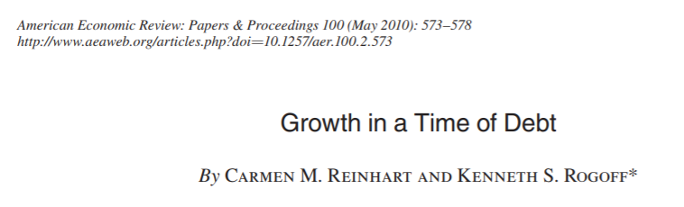
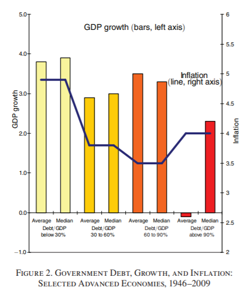
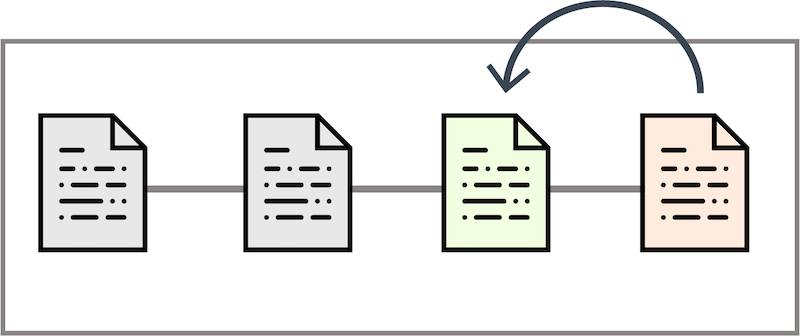
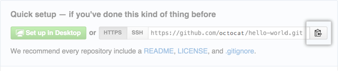
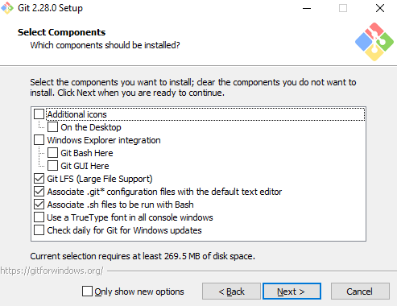
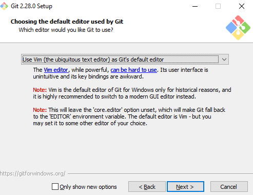
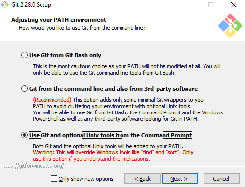

# Why is reproducible science important?

.pull-left[
<br><br>
- Paper by Reinhart & Rogoff (2010)

- Link between debt and GDP growth

- When $$debt > 90 \% = \text{GDP growth} \sim 0$$

- Used as an argument for austerity plans


]

.pull-right[
```{r, echo=F}

```

```{r, echo=F, out.width="90%"}

```
]

---

# Why is reproducible science important?


.pull-left[
<br><br>
- Paper by Reinhart & Rogoff (2010)

- Link between debt and GDP growth

- When $$debt > 90 \% = \text{GDP growth} \sim 0$$

- Used as an argument for austerity plans
<br><br><br>
.center[
CALCULATION ERROR!

ARBITRARY DECISIONS!
]
]


.pull-right[
```{r, echo=F}

```

```{r, echo=F, out.width="90%"}

```
]

---

# Pros of Reproducible Science
<br><br>

- **Transparency**: data, code and methods available allow verification

- **Quality assurance**: identification and correction make results more reliable

- **Facilitate collaborations**: see what are colleagues doing 

- **Peer review**

- **Educational value**

- **Enhanced public trust**

???

The means have been computed in a weird way.

They didn't use some data that had a high GDP growth with a debt higher than a 100% (we don't know why)

The most important: there was as mistake in on of the excel formula 

After correction: 2.2% instead of the 0%


--

<br><br>
.center[
**All of this using Git and Github**
]

---

# Version control: what is (G)it?

**Version Control:**

.center[
*Program responsible for managing changes to computer programs, documents, large 
websites or other collection of information*
]

--

<br>

- Git was created Linus Torvalds in 2005

- You can backup versions (or "saves", like in a videogame) of a file/directory

- A version is called a **commit**

- Each commit is identified by a unique tag and a message

--

.pull-left[
<br><br>
**Allows you to come back to a specific commit**
]

.pull-right[
```{r, echo=F}



```

]

---
class: inverse, center, middle

# GitHub

## A powerful tool for reproducible science

---

# GitHub

- **Online platform**: this is (just) the online version of Git. If you want to understand Github, you need first to understand Git

- **Repository hosting**: you can store and manage your files and their versions from any device

- **Collaborative features**: people can suggest modifications of your code (pull request)

- **Issues tracking**

- **Branching and merging between collaborators**

- **Code review**

- **Github pages**: create and host your website directly from a repository

---
class: inverse, center, middle

# How to use Git?


---

# Initialize your repository

<br>
- **Repository** ("repo") = directory that is version-controlled by Git, with files and history of their changes

--

<br>
- This is the very first necessary step

--

<br>
- For this, use `git init` in your Command Line Interface

--

<br>
- Now, a hidden directory `.git` can be found at the root of your project

--

<br>
.center[
**Don't ever modify this directory directly,<br>this is where all your backups are!!!!!**
]
---

# Your first commit

- First of all, the most useful command:

``` 

git status

```

--

Will tell you the *branch* you are on, the *deleted*, *modified*, *created* files, if the local commits are pushed, which changes are **staged**...

--

- **Stage** the changes using:

``` 

git add name_file_1 name_file_2 ... name_file_n  # if you want to stage specific changes, or
git add .                                        # if you want to stage every changes

```
--

- **Commit** using:

```shell 

git commit                      # a text editor will open where you can write the commit message. Or,
git commit -m "Commit message"  # if you want to write directly the commit message

```


---

# Branches


**Branch** = parallel line of development that diverges from the main line ("main" branch). Branches are used to isolate changes and work on new features or fixes without affecting the main codebase.

.pull-left[
<br><br>
```{r, echo=F}

knitr::include_graphics("images/branch.png")

```
]

--

.pull-right[

- At first, you will just see the branch `main`

``` 
git branch 
  * main
```

- You can create new branches

```
git branch new_branch_name
```

- And switch between branches


``` 
git checkout name_branch
Switched to branch 'name_branch'
```

]

---


# Merge and conflicts

.pull-left[
<br><br><br><br><br>
```{r, echo=F}

knitr::include_graphics("images/branch.png")

```
]

.pull-right[

- **Merge** branches together

From the `main` branch, use:

```
git merge new_branch
```

This combines changes from both branches into a new commit

- **Conflicts**: if a file is modified on two branches, Git can't decide which change to keep when merging, causing a **conflict**. 

To resolve conflicts, manually edit the conflicted file, stage it with `git add`, continue the merge with `git merge --continue`, and commit the merge.

]


---

# Check your commits and changes

<br><br>

- List the commits using:

``` 

git log             # or
git log --oneline   # or
git reflog

```

You will see the **SHA** (Simple Hashing Algorithm = unique id of your commit), the author, date/time, commit message

--

<br><br>

- See the changes of a commit:

```
git show <SHA>
```


---

# Undo your commits

.center[
**There are different ways to do it but the most common one is reset**
]

--

- `git reset` is dangerous: you go back to the desired commit and "erase" all the commit created since 

```

git reset --hard <SHA>

```

However, you can bypass this by using:

```
git reset --hard <previous-SHA>
git reset --soft <last-SHA>
```

--

- `git checkout` allows to create a temporary branch with the commit wanted


``` 

git checkout <SHA>

```

---

# Useful tips


**Ignore files**

- You can specify the files/directories that you never want to commit in the `.gitignore` file


--
<br>

**git stash**

- Saves the modifications you made after the last commit without having to make a commit using `git stash`

- List the stashes using `git stash list`

- You can bring back a specific stash using `git stash apply stash@{n}` 

---
class: inverse, center, middle

# Moving on to 

# GitHub

---

# Publish your local repository online

.pull-left[

- Create a repository on Github

<br><br>
- Click on the clipboad to copy the remote

]


.pull-right[
```{r, echo=F, out.width="30%"}
knitr::include_graphics(path = "images/repo-create.png")
```
<br>

]

--

- Now, `push` your existing repository from the command line:

```
git remote add origin https://github.com/user_name/repo_name.git
git branch -M main
git push -u origin main
```

--
<br>
.center[
**From now on, you will be able to publish your commits using** `git push`

**Also, you can dowload the modifications that are published on Github by using** `git pull`
]

---

# Large File Storage

- GitHub has a file size limit: 100 MB

- You can bypass this limit using **Git Large File Storage**

- You need to install the software ([here](https://git-lfs.com/))

- Specify the large files you want to track using `git lfs track images/*.png`

- This will create a file `.gitattributes`

- Next commit you'll do, the tracked large files will be handled in a specific way so you can push the commits online

---

# Clone a github repository


.center[
**Nothing more simple**
]

--

<br><br>

- Go on your favorite Github repository

<br><br>

- Copy the URL of this repository

<br><br>

- Clone it from the command line using:

```
git clone https://github.com/user_name/repo_name.git
```
---

# Forking a github repository

- A fork is a personal copy of a github repository

<br><br>

- It create a new independent repository that you can modify as much as you want, without modifying the original repo

<br><br>

- Also, you can ask to merge your modifications to the original repo using a `pull request`

---

# Github pages

- A really cool feature of Github is that you can create an HTML page for a repository

<br>

- For this, go in *Settings > Options > Github Pages*, select the branch and the folder that contains the .html file

<br>

- Github will automatically look for a file named `index.html` to build from

<br>

- If your html file is not called `index.html`, you can visit the URL provided by Github and add the name of the html file at the end (*e.g.* `URL/my_file.html`) and your website will be there!

<br>

- You also get one website per Github account @ `username.github.io`

---
class: inverse, center, middle

# Friendly user applications

### [<ins>Github desktop</ins>](https://desktop.github.com/) 

### [<ins>Visual Studio Code</ins>](https://code.visualstudio.com/)

---
class: inverse, center, middle

# Thank you for your attention

## Now, install git from [<ins>here</ins>](https://git-scm.com/)

---

# Tips for git installation


* You can either spam `next` and then click `install`


.center[
**Or**
]

* Uncheck the `Additional icons` and `Windows Explorer integration` features (they are cumbersome)

.center[
```{r, echo=F, out.width="60%"}



```
]

---

# Tips for git installation


* Here you can choose the text editor used for commits, picking and squashing... By default, Git is set up to use Vim (and you need to know Vim commands to use it)

.center[
```{r, echo=F, out.width="60%"}



```
]

---

#  Tips for git installation

* Last but not least: here you can set up Git in order to also use shell commands (and not only commands specific to your OS). It also allows the (very very) cool `Julia`'s feature to use shell commands directly in the `Julia` REPL

.center[
```{r, echo=F, out.width="60%"}



```

]

---

# One last thing

<br>

* If you just installed Git on your computer, it may come useful to specify your name and email address to Git using:

```

git config --global user.name "Your name"

git config --global user.email "address@domain"

```

<br>

* Now, you should be able to see these changes using:

```

git config --global --list

```


